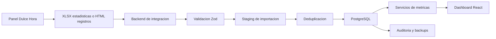
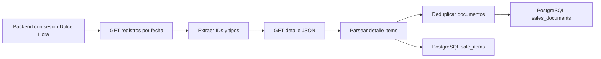
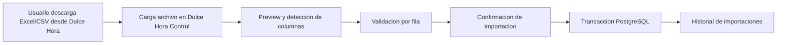
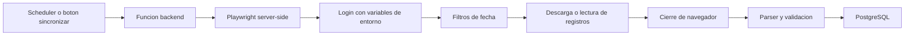

# Flujo de datos

Estado: propuesta de Fase 1.

## Flujo preferido

## Flujo documento por documento

Allowlist inicial de lectura:

- `/panel/facturacion/registros?fecha=YYYYMMDD`
- `/panel/facturacion/comprobante?id=<id>`
- `/panel/facturacion/comprobante/fiscal?id=<id>`
- `/panel/facturacion/comprobante/parcial?id=<id>`
- `/panel/estadisticas/local/exportar`

## Flujo con importacion manual

## Flujo con Playwright backend

## Politicas

- No ejecutar Playwright en el navegador del usuario.
- No guardar contrasenas en logs.
- No superar una solicitud por segundo durante descubrimiento.
- Importaciones deben ser idempotentes.
- Reimportar un periodo debe reemplazar solo ese periodo y esa fuente.
- Cada importacion debe generar `imports` y, si es sync automatica, `sync_runs`.
